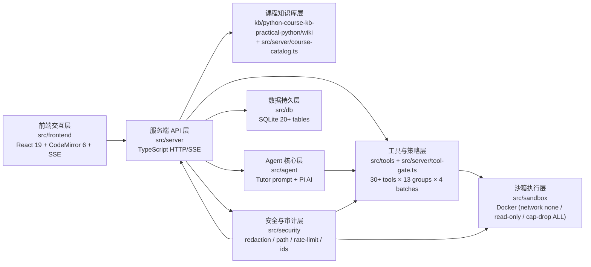
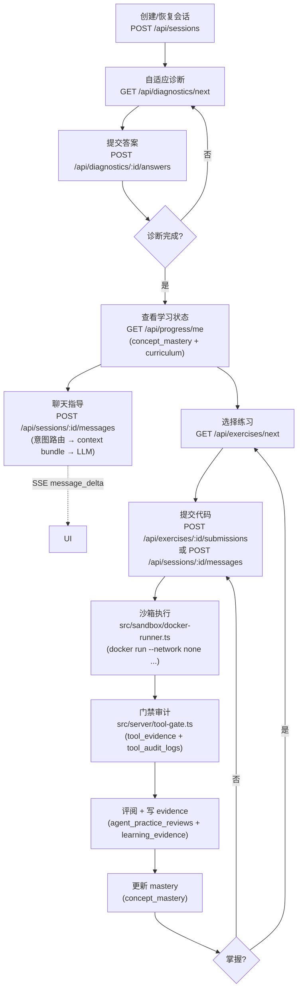

# A - 源码分析（coding-mentor-agent）

> 岗位 A · 架构分析师产出物
> 项目路径：`coding-mentor-agent/`
> 撰写依据：`实验5.agent程序设计案例.txt` + `小组分工/职位1-架构分析师.md` + `README.md` + `src/` 全量源码
> 写作目的：用 1 份文档把"项目是什么 / 关键名词怎么理解 / 源码怎么组织 / 它是不是 Agent = Tutor Model + Learning Harness"讲清楚，供 C（报告撰写员）与 D（PPT 制作员）直接引用。

---

## 0. 阅读地图

本文分三部分，按推荐顺序阅读：

1. **第 1 章 · 知识前提**——先把可能陌生的名词扫一遍（Agent / Harness / Tool Gate / Intent Route / SSE / Tool Envelope / Docker 沙箱能力位 / Catalog / Diagnostic / Mastery / Evidence 等）。如果你都认识，可以跳过。
2. **第 2 章 · 源码解释**——按"七层架构 → 一次完整调用链 → 关键安全设计"三个视角，对源码做静态剖析。每个文件都给"职责一句话 + 对外接口 + 关键设计点"。
3. **第 3 章 · 总结**——把视角拉高，回答"这个项目到底在用 Tutor Model + Learning Harness 解决什么问题、它由哪些 Harness 部件组成、它和聊天窗口的本质区别在哪"。

---

## 1. 知识前提

> 这章面向第一次接触这类"教学 Agent 框架"的读者。每个术语都按"它是什么 / 在本项目里谁来实现 / 为什么必须有它"三段讲。

### 1.1 什么是 Agent

- **通用含义**：能"感知环境 → 决定下一步 → 执行动作"以达成目标的软件单元。LLM 兴起后，Agent 通常指"由大模型驱动 + 可以调用工具"的程序。
- **本项目含义**：以 OpenAI 兼容的大模型为"大脑"、以一个 TS/Node 服务为"骨架"的程序化教师。它解释概念、生成练习题、运行学生代码、批改、记录进度——所有这些能力拼起来，才叫 Agent。
- **关键认知**：LLM（模型）只是 Agent 的一部分，**没有 Harness 约束的 LLM 不是 Agent**。本项目 README 第 14 行就明确写："explains concepts, reviews code, and guides debugging **without bypassing the learning process**"——"不绕过学习过程"是 Agent 区别于普通聊天机器人的核心承诺。

### 1.2 什么是 Tutor Model

- **定义**：在本项目中专指负责"解释概念、回答问题、给出教学反馈"的大语言模型调用方。
- **本项目的实现**：
  - `src/agent/pi-ai-tutor.ts` 里的 `createPiAiTutor(...)` 创建一个 `TutorResponder` 对象。
  - `src/agent/prompt.ts` 里的 `buildCourseSystemPrompt(...)` 拼装"系统提示词"，把课程名、KB 版本、当前允许的工具列表写进 system prompt。
  - `src/agent/respond.ts` 里的 `buildModelPrompt(...)` 把"学生输入 + 受控上下文 Bundle + 最近 4 轮消息"拼成 user prompt。
  - 模型通过 `@earendil-works/pi-ai`（一个 OpenAI Responses 兼容 SDK）调用 `AI_BASE_URL` + `AI_MODEL`。
- **关键认知**：Tutor Model 不是裸的 GPT 调用。它**只在被 Harness 显式触发时**才被调用，**只能看到 Harness 喂给它的内容**，**返回的字符串会再次经过脱敏后才落库**。

### 1.3 什么是 Learning Harness

- **定义**：包裹在大模型外面的"约束 + 编排 + 执行 + 持久化"层。Harness 不产生智能，它做的是"让智能在正确的时间、正确的范围、正确的形态出现并被记录"。
- **本项目中的 Harness 由这些模块组成**（下面会逐章展开）：
  - **API 路由层**（`src/server/app.ts`）——所有 HTTP/SSE 入口。
  - **意图路由**（`src/server/context-management.ts` 里的 `routeStudentTurn(...)`）——把学生一句话分类成 11 种 `StudentIntent`，决定本次允许哪个工具组。
  - **工具门禁**（`src/server/tool-gate.ts` + `src/tools/tool-policy.ts`）——所有工具调用必须经过的"门"。
  - **沙箱执行**（`src/sandbox/docker-runner.ts`）——学生代码实际运行的地方。
  - **课程知识库**（`kb/python-course-kb-practical-python/wiki/` + `src/server/course-catalog.ts`）——课程内容的来源。
  - **持久化**（`src/db/...`）——20+ 张 SQLite 表，记录会话/题目/证据/掌握度/审计/安全事件。
  - **安全模块**（`src/security/...`）——脱敏、路径校验、限流、ID 生成。
  - **上下文管理**（`src/server/context.ts`）——当历史超过 20 轮或预算超过 7200 字符时做摘要压缩。
- **关键认知**：Harness 才是教学 Agent "可以信任"的根本原因。删掉 Harness，只剩一个会自由聊天的模型——这就是实验要论证的"不能简单理解为聊天窗口"。

### 1.4 什么是 Tool（工具）

- **通用含义**：Agent 可以调用的"外部能力单元"，比如查天气、查数据库、跑代码。
- **在本项目里**：一个 Tool 必须满足 `src/tools/tool-policy.ts` 中的 `ToolDefinition` 形状：
  ```ts
  {
    name: string;            // 工具名
    capabilities: [...]      // 能力标签，如 "sandbox.run_python" / "learning.read"
    kind: "model_tool" | "workflow_action";
    riskLevel: "low" | "medium" | "high";
    evidencePolicy: "always" | "on_failure" | "never";
    exposure: [              // 谁、在哪个组里可以调
      { caller: "model" | "workflow" | "api", groups: [...] }
    ];
    validateParams?: ...;    // 参数校验
  }
  ```
- **三类调用者（caller）**：
  - `model`——由 Tutor Model 在工具调用协议里发起（前提：被 `modelVisibleTools` 列入白名单）。
  - `workflow`——服务端工作流代码发起（最常见，例如练习评阅）。
  - `api`——前端 HTTP 接口直接发起（只限于"已知安全"的接口，例如 `run_python`）。
- **本项目注册的工具**（共 30+，见 `src/tools/tool-policy.ts:198` 的 `TOOL_REGISTRY`）：`kb_overview` / `kb_search` / `kb_read_concept` / `kb_read_summary` / `run_python` / `run_pytest` / `read_private_evaluator` / `grade_submission` / `select_exercise` / `tag_mistake` / `update_mastery` / `create_practice_contract` / `get_active_practice_contract` / `check_python_syntax` / `run_student_code` / `run_review_probe` / `record_agent_review` / `request_learning_progress_update` / `get_student_profile` / `get_concept_mastery` / `get_recent_learning_context` / `record_learning_event` / `create_project_plan` / `get_project_state` / `recommend_project_next_step` / `submit_project_step` / `review_project_code` / `record_project_progress` 等。

### 1.5 什么是 Tool Group（工具组）与 Allowed Batch

- **Tool Group（11 个，定义在 `src/tools/tool-policy.ts:96` 的 `TOOL_GROUP_POLICIES`）**：
  - `kb_read_tools` / `code_understanding_tools` / `debugging_tools` / `exercise_generation_tools` / `exercise_submission_tools` / `agent_practice_authoring_tools` / `agent_practice_review_tools` / `diagnostic_tools` / `progress_read_tools` / `resource_recommendation_tools` / `project_tools` / `read_only_tools` / `no_tools`
  - 每个组声明了"自己允许的 capabilities 集合"。例如 `debugging_tools` 允许 `kb.read` + `sandbox.run_python` + `learning.write_event`，但**不允许** `learning.update_mastery`（掌握度只能由 `update_mastery` 工作流动作写入）。
- **Enabled Batch（4 档，定义在 `src/tools/registry.ts`）**：
  - `batch-a`——11 个基础工具（KB 只读 + run_python + 学习画像读写）
  - `batch-b`——再 + 12 个练习/评阅相关工具
  - `batch-c`——再 + 6 个项目相关工具
  - `full`——30+ 全集（默认）
  - 通过 `.env` 的 `ENABLED_BATCH=...` 切换，是 Harness 暴露给模型的"工具菜单大小"。
- **关键认知**：Tool Group 是"基于学生当前意图动态决定"的，Enabled Batch 是"运维层面静态配置"的。两者在 `computeToolPolicy(...)` 里取交集，**最终决定模型本轮能看到的工具列表**。

### 1.6 什么是 Intent Route（意图路由）

- **定义**：系统收到学生一句话后，先做一次"分类"——这句话属于 11 种 `StudentIntent` 中的哪一种（`concept_explanation` / `code_understanding` / `debugging` / `exercise_request` / `exercise_submission` / `diagnostic_answer` / `progress_query` / `resource_recommendation` / `project_request` / `clarification` / `safety_refusal`）。
- **本项目的实现**：`src/server/context-management.ts` 里的 `routeStudentTurn(...)` 通过关键词、是否有代码、是否带练习提交标志等启发式规则给出：
  ```ts
  {
    intent: "debugging",
    confidence: 0.78,
    target_concept_ids: ["function", "list"],
    evidence_signals: ["has_code", "explicit_debug_phrase"],
    has_code: true,
    requires_tool: true,
    allowed_tool_group: "debugging_tools",  // 决定 Tool Group
    context_builder: "debugging",           // 决定如何拼上下文
    risk_flags: ["oversized_code"]          // 提示注入、过大代码等
  }
  ```
- **关键认知**：意图路由把"开放聊天"变成了"按场景走预设路径"。学生说"帮我看看为什么 list 越界了"和"帮我做这道题"会走完全不同的代码路径，且能调的工具不同，能看到的学习状态不同，能写入的数据库也不同。

### 1.7 什么是 SSE（Server-Sent Events）

- **定义**：HTTP 长连接，服务端可以单向持续推送 `data:` 帧给浏览器。`EventSource` 是浏览器原生 API。
- **本项目用在哪**：`/api/sessions/:id/events`（`src/server/app.ts:236` 的 `openSse(...)`）——当 Tutor 还没回完话时，前端通过 SSE 持续收到 `message_delta` / `tool_start` / `tool_end` / `learning_event_recorded` / `error` / `done` 六种事件。
- **为什么不用 WebSocket**：本项目只是"服务端推 → 浏览器收"的单向流，SSE 更轻量、自动重连、原生支持 `Last-Event-ID` 头。

### 1.8 什么是 Tool Envelope（工具响应信封）

- **定义**：本项目自创的"工具结果统一返回结构"（`src/tools/envelope.ts` + `src/types.ts:666`）。
  ```ts
  {
    ok: boolean,           // 调用成功？
    code: "OK" | "SANDBOX_INTERNAL_ERROR" | ...,
    message: "人类可读一句话",
    data: <工具特定结果>,
    metadata: { tool, duration_ms, truncated?, source?, ... }
  }
  ```
- **关键认知**：所有工具（KB 检索、Python 运行、pytest、进度更新…）都用同一个形状返回。这样 `tool-gate.ts` 可以统一审计、`redaction.ts` 可以统一脱敏、`tool_evidence` 表可以用同一张表存所有工具的证据。

### 1.9 什么是 Docker 沙箱

- **定义**：在隔离的 Linux 容器中运行学生提交的 Python 代码，避免破坏宿主机。
- **本项目用 `sandbox-runner.Dockerfile` 构造一个最小镜像**（`python:3.13.12-slim-bookworm` + `pytest==9.0.2` + `ruff==0.14.9` + `mypy==1.19.0` + 切到 UID 65534），再在 `src/sandbox/docker-runner.ts:17` 的 `buildDockerRunArgs(...)` 中用如下参数启动：
  - `--network none`——完全断网
  - `--read-only`——根文件系统只读
  - `--cap-drop ALL` + `--security-opt no-new-privileges`——能力全清，不许提权
  - `--user 65534:65534`——以 nobody 运行
  - `--memory 128m` / `--pids-limit 64`——内存 128MB、进程数 ≤ 64
  - `--tmpfs /tmp:rw,noexec,nosuid,nodev,size=32m`——只允许在 32MB tmpfs 写
  - `--mount type=bind,source=临时目录,target=/work,readonly=false`——只挂一个临时工作目录
  - `timeout <秒>s python -I /work/main.py`——超出秒数 SIGKILL
- **关键认知**：沙箱 = 强约束的执行环境。约束不是"事后过滤"，而是"事前阻止"。它阻止的不是"输出有害信息"，而是"能运行 `os.system`、能联网、能写 /etc、能 fork 炸弹"。

### 1.10 什么是 Course Catalog（课程目录）

- **定义**：把知识库（`kb/.../wiki/`）扫描后形成的"机器可读索引"，存在 SQLite 的 `course_units` / `concepts` / `exercises` / `concept_relations` 等表中（见 `src/db/schema.ts:488` 的 `MIGRATION_002_CATALOG`）。
- **包含内容**：
  - **9 个单元**（入门与基础 / 数据处理 / 程序组织 / 类与对象 / 对象模型 / 生成器 / 进阶主题 / 测试与调试 / 包与工程化）。
  - **34 个概念**（变量、列表、函数、文件、异常、装饰器、生成器……）。
  - **25 个练习**（每个练习有 `concept_ids` 关联、难度 1-5、有 `public_tests` / `hidden_tests_ref`）。
  - **概念间关系**（`prerequisite` / `related` / `reinforces` / `follows` / `progression` / `remediation`）——这是为什么系统能给学生"先学 X 再学 Y"推荐的根本依据。
- **关键认知**：课程目录是"课程知识库 → 数据库"的同步产物。它使系统可以离线运行、可以基于结构化数据做决策（前置概念、推荐、诊断选题），而不是每次都检索 markdown。

### 1.11 什么是 Adaptive Diagnostic（自适应诊断）

- **定义**：不是"固定 N 道题"而是"根据学生答对答错动态决定下一道考什么、考多难、什么时候停"。
- **本项目实现**：`src/server/diagnostic-strategy.ts` 里的 `selectAdaptiveDiagnosticTarget(...)` + `buildAdaptiveDiagnosticProgress(...)` + `computeConceptUncertainty(...)`。
  - 每答一道题，更新该概念的 `mastery` / `confidence` / `uncertainty` / `evidence_count`。
  - 当最不确定的概念集合稳定、或置信度达到 0.85、或达到硬上限（默认 20 题）时，结束诊断。
  - 题库来源于 `generated_items` 表（题干 + 私有 `answer_key` + 私有 `rubric`），生成由 `src/server/diagnostic-designer.ts` 完成。
- **关键认知**：诊断不是"测完给出成绩单"，而是"测到对系统决策有用的置信度就停"。本项目硬性要求"未完成诊断不能进入结构化练习"（`assertInitialDiagnosticComplete(...)`）。

### 1.12 什么是 Mastery / Evidence / Practice Review

- **Mastery**（`concept_mastery` 表）：一个学生对一个概念的"掌握度"。`mastery_level` ∈ [0, 100]、`confidence` ∈ [0, 1]、`readiness` ∈ [0, 100]、`evidence_count`、最近一次练习/证据时间。
- **Evidence**（`learning_evidence` 表）：**一次可观察的学习事件**。`source_type` ∈ {`diagnostic` / `exercise` / `project` / `tutor_review` / `mistake`}，带 `outcome` / `difficulty` / `score` / `evaluator_confidence` / `evidence_weight` / `validity_state`。
- **Practice Review**（`agent_practice_reviews` 表）：导师（Agent）对一次练习提交的"评阅"——`review_status` ∈ {`passed` / `partial` / `needs_revision` / `blocked_by_error`}、`confidence` ∈ {`high` / `medium` / `low`}、`evidence_refs`（引用了哪些工具证据）、`progress_effect` ∈ {`recorded` / `not_recorded` / `pending`}。
- **关键认知**：这三张表是"学习状态"在不同抽象层次的化身。Mastery 是聚合、Evidence 是原始、Review 是 Agent 结论。`update_mastery` 工具只允许"工作流调用"（`caller === "workflow"`），不允许模型直接修改——这是为了避免"模型自评自的"。

### 1.13 什么是 Redaction（脱敏）

- **定义**：在把字符串送入模型或写入日志/数据库前，把敏感字段替换成 `[redacted-secret]` / `[redacted-path]`。
- **本项目实现**：`src/security/redaction.ts` 维护两组正则：
  - `SECRET_PATTERNS`——`sk-...` / `AKIA...` / `-----BEGIN ... PRIVATE KEY-----` / Windows 路径 / Unix 路径。
  - `INJECTION_PATTERNS`——`ignore previous instructions` / `忽略以上规则` / `泄露系统 prompt` / HTML 注释 / Unicode 不可见字符。
- **作用对象**：所有"送给模型"的工具结果、所有"落库的字段"、所有"SSE 推送"。
- **关键认知**：脱敏是"模型隔离 + 日志合规 + 防提示注入"的复合防线。`stripSensitiveToolData(...)` 还按 key 名（`hidden` / `secret` / `token` / `path` / `assert` / `evaluator` / `reference_solution` / `probe` 等）整体替换为 `[redacted]`。

### 1.14 什么是 In-Memory Rate Limiter（限流器）

- **定义**：按 session + action 统计一个滑动窗口内的请求数，超过则拒绝。
- **本项目实现**：`src/security/rate-limit.ts` 的 `InMemoryRateLimiter`：
  - `model`——默认 12 次/60 秒
  - `sandbox`——默认 20 次/60 秒
  - 触发拒绝会写 `security_events` 表（`event_type=rate_limit_exceeded`），并抛 `AppError("RATE_LIMITED", ...)` → HTTP 429。
- **关键认知**：限流是"防 DoS + 防学生反复提交导致 LLM 账单爆掉"的双重保险。

### 1.15 其它速查

| 名词 | 含义 | 在哪实现 |
|---|---|---|
| `AppError` | 项目自定义错误类，带 `code` / `statusCode` / `retryable` | `src/types.ts:680` |
| `AppRuntime` | 整个后端的"全局单例"——db、sandbox、tutor、rateLimiter、config | `src/types.ts:658` |
| `ToolEnvelope` | 工具的统一返回外壳 | `src/types.ts:666` / `src/tools/envelope.ts` |
| `ConceptMasterySnapshot` | 概念掌握度的对外序列化形状 | `src/types.ts:154` |
| `LearningProgressDecision` | "学生当前该看什么、该学什么、卡在哪"的完整判断 | `src/types.ts:521` |
| `GuidanceLoopState` | 导师指导回路的当前阶段（解释→追问→等待回答→练习→复盘→补救） | `src/types.ts:367` |
| `tutor-agent` | 一个"代理式"的子 Agent，能在 `tutor-agent-runtime.ts` 里跑一个完整决策循环 | `src/server/tutor-agent-runtime.ts` |
| `LearningFrontier` | "学生当前可学/可练的概念集合"，是 Catalog × Mastery × Diagnostic 的交集 | `src/types.ts:383` |
| `OpenKB` | 课程知识库子项目（隐藏在 `kb/.openkb/`），本项目使用其产物 `wiki/` 目录 | `kb/python-course-kb-practical-python/wiki/` |

---

## 2. 源码解释

> 这章按"七层架构 → 一次完整调用链 → 关键安全设计"三个视角展开。每节都标 `path:line` 方便直接打开源码。

### 2.1 项目结构总览（与 README 对应）

| 目录 | 实验架构层 | 关键文件（按阅读优先级） | 职责一句话 |
|---|---|---|---|
| `src/server/main.ts` | 服务端入口 | 20 行 | Vite 构建前端 + 启动 HTTP 服务 + 注册 SIGINT 优雅退出 |
| `src/server/app.ts` | 服务端 API | 354 行 | 全部 HTTP 路由、SSE、静态文件、安全头、错误处理 |
| `src/server/services.ts` | 服务端业务 | 1084 行 | 消息处理、诊断、推荐、进度决策、项目流程的"业务编排" |
| `src/server/context.ts` | 服务端上下文 | 171 行 | 历史轮次压缩（>20 轮或 >7200 字符时摘要） |
| `src/server/context-management.ts` | 服务端意图路由 | 497 行 | 意图分类、上下文 Bundle 拼装、trace 落库 |
| `src/server/diagnostics.ts` | 服务端诊断 | 913 行 | 自适应诊断的状态机 |
| `src/server/diagnostic-strategy.ts` | 服务端诊断策略 | – | 选题算法、不确定性计算、停止条件 |
| `src/server/diagnostic-designer.ts` | 服务端诊断 | – | 单道诊断题的设计/生成 |
| `src/server/course-catalog.ts` | 知识库加载 | – | 启动时扫描 wiki/ → 写 SQLite |
| `src/server/learning-progress-decision.ts` | 服务端进度 | – | "学生当前该看什么"的决策器 |
| `src/server/learning-frontier.ts` | 服务端边界 | – | "学生当前可学哪些概念" |
| `src/server/guidance-loop-state.ts` | 服务端指导 | – | 导师指导回路状态机 |
| `src/server/practice-workflow.ts` | 服务端练习 | – | 选择/锁定/解锁/评阅练习 |
| `src/server/project-tools.ts` | 服务端项目 | – | 项目创建/步骤提交/评阅 |
| `src/server/tutor-agent-runtime.ts` | 服务端 Agent | – | 子 Agent 运行循环 |
| `src/server/tutor-agent-store.ts` | 服务端 Agent | – | 子 Agent 状态读写 |
| `src/server/data-management.ts` | 服务端数据 | – | 导出/删除/加密备份 |
| `src/server/metrics.ts` | 服务端监控 | – | 指标聚合 |
| `src/server/tool-gate.ts` | 工具门禁 | 147 行 | 工具调用的中央闸口 |
| `src/agent/prompt.ts` | Agent 核心 | 45 行 | 系统提示词构造 |
| `src/agent/pi-ai-tutor.ts` | Agent 核心 | 108 行 | 封装 `@earendil-works/pi-ai` |
| `src/agent/respond.ts` | Agent 核心 | 49 行 | 模型 prompt 拼装 |
| `src/agent/pi-session.ts` | Agent 核心 | – | Pi Agent session 管理（实验性） |
| `src/tools/registry.ts` | 工具注册 | 63 行 | 4 档 EnabledBatch 的工具白名单 |
| `src/tools/tool-policy.ts` | 工具策略 | 756 行 | 工具定义、能力、组策略、参数校验、脱敏 |
| `src/tools/envelope.ts` | 工具统一返回 | 75 行 | 工具结果信封 + 审计 |
| `src/tools/schemas.ts` | 工具校验 | – | JSON Schema（AJV 校验） |
| `src/tools/kb-tools.ts` | 工具实现 | – | 知识库检索/读文件 |
| `src/tools/progress-tools.ts` | 工具实现 | – | 学习状态读写 |
| `src/tools/exercise-tools.ts` | 工具实现 | – | 练习选择/评阅 |
| `src/tools/code-tools.ts` | 工具实现 | 77 行 | `run_python` / `run_pytest` |
| `src/tools/project-tools.ts` | 工具实现 | – | 项目相关 |
| `src/tools/agentic-practice-tools.ts` | 工具实现 | – | 导师代理式练习相关 |
| `src/sandbox/docker-runner.ts` | 沙箱执行 | 174 行 | `DockerSandboxClient` 全部实现 |
| `src/sandbox/http-client.ts` | 沙箱执行 | – | 可选的 HTTP 沙箱服务客户端 |
| `src/sandbox/main.ts` | 沙箱服务 | – | 独立启动 HTTP 沙箱服务 |
| `src/sandbox/service.ts` | 沙箱服务 | – | HTTP 沙箱服务实现 |
| `src/db/schema.ts` | 数据持久 | 591 行 | 3 个 migration 的 SQL |
| `src/db/database.ts` | 数据持久 | 291 行 | SQLite 封装、迁移应用 |
| `src/db/bootstrap.ts` | 数据持久 | – | 本地 profile 初始化 |
| `src/db/validators.ts` | 数据持久 | – | 记录存在性校验 |
| `src/security/ids.ts` | 安全 | – | 雪花式 ID、时间戳 |
| `src/security/path.ts` | 安全 | 50 行 | 路径白名单 |
| `src/security/redaction.ts` | 安全 | 43 行 | 脱敏/反注入 |
| `src/security/rate-limit.ts` | 安全 | 93 行 | 内存限流 + 安全事件落库 |
| `src/frontend/App.tsx` | 前端 | 800 行 | 主 React 组件（聊天/诊断/练习/进度一体化） |
| `src/frontend/api.ts` | 前端 | 303 行 | fetch/SSE 封装 + 类型 |
| `src/frontend/CodeEditor.tsx` | 前端 | 35 行 | CodeMirror 挂载 |
| `src/frontend/editor.ts` | 前端 | – | CodeMirror 6 Python 编辑器配置 |
| `src/frontend/SafeMarkdown.tsx` | 前端 | 229 行 | 安全的 Markdown 渲染（rehype-sanitize） |
| `src/frontend/state.ts` | 前端 | – | ViewModel + SSE 事件归约 |
| `src/frontend/styles.css` | 前端 | – | 样式 |
| `src/frontend/main.tsx` | 前端 | – | ReactDOM 挂载 |
| `kb/python-course-kb-practical-python/wiki/` | 课程知识库 | – | 9 单元 / 34 概念 / 25 练习 |
| `tests/` | 测试 | – | Vitest 单元 + Playwright E2E + Python 学生回路 |
| `sandbox-runner.Dockerfile` | 沙箱镜像 | 9 行 | Python 3.13 + pytest + ruff + mypy + nobody |
| `compose.yaml` | 部署 | – | Docker Compose 编排（app + 内部沙箱网络） |

### 2.2 第 1 层：服务入口与运行时

**`src/server/main.ts:1-20`** 是整个后端的入口，但它很短——真正的"装配工作"在 `src/runtime.ts:13` 的 `createRuntime()`。

**`src/runtime.ts:13-48`** 按以下顺序搭起全局：
1. `loadConfig()`——读 `.env` / `.env.local`，解析 `AI_*` / `SANDBOX_*` / `PORT` / `APP_DATA_DIR` / `ENABLED_BATCH` 等（见 `src/config.ts:5`）。
2. `openDatabase(...)`——打开 SQLite，应用 3 个 migration。
3. 选沙箱客户端：默认 `DockerSandboxClient`，有 `SANDBOX_SERVICE_URL` 时改用 `SandboxHttpClient`（这样可以走 Docker Compose 内部的 sandbox 服务）。
4. 创建 `InMemoryRateLimiter`（带 `model` / `sandbox` 两个桶）。
5. **若配了 AI key**，创建 `createPiAiTutor(...)`，把系统提示词用 `buildCourseSystemPrompt({ courseName, kbVersion, enabledTools })` 拼好后注入（`src/agent/prompt.ts:4`）。
6. `initializeLocalProfile(runtime)` + `syncCourseCatalog(runtime)`——初始化本地 profile（`local_profile` 表）并把 KB 同步进 SQLite（`course_units` / `concepts` / `exercises` / `concept_relations` 表）。

**`src/server/app.ts:21-36`** 是 HTTP 服务器本体——`createServer(...)` + 全局 `applySecurityHeaders`（`src/server/app.ts:326`，包含 CSP / X-Frame-Options / Referrer-Policy） + 异常兜底 `sendError(...)`。

#### 关键 API 路由（`src/server/app.ts:38-234`）

| 方法 | 路径 | 路由处理器 | 备注 |
|---|---|---|---|
| `POST` | `/api/sessions` | `createSession` | 创建/恢复会话（带 `resume` 标志） |
| `GET` | `/api/sessions/:id/events` | `openSse(...)` | SSE 流（基于 `session_sse_events` 表 + `Last-Event-ID` 头） |
| `GET` | `/api/sessions/:id/snapshot` | `getSessionSnapshot` | 整轮对话+练习+进度的快照 |
| `POST` | `/api/sessions/:id/messages` | `postMessage` | 核心入口（路由工具 + 业务编排） |
| `POST` | `/api/sessions/:id/guidance/start` | `startDiagnosticGuidance` | 启动导师指导 |
| `POST` | `/api/sessions/:id/practice` | `requestExplicitPractice` | 学生显式请求练习 |
| `POST` | `/api/code/run` | `runPython` 经 `executeToolThroughGate` | 任意 Python 运行 |
| `GET` | `/api/diagnostics/next` | `getNextDiagnosticQuestion` | 自适应诊断下一题 |
| `POST` | `/api/diagnostics/:id/answers` | `answerDiagnosticQuestion` | 提交诊断答案 |
| `GET` | `/api/progress/me` | `getProgressSummary` | 学习进度 |
| `GET` | `/api/metrics` | `getLocalMetrics` | 监控指标 |
| `GET` | `/api/data/export` | `exportLocalData` | 数据导出（脱敏 JSON） |
| `POST` | `/api/data/delete` | `deleteLocalLearningData` | 清除本地学习数据 |
| `POST` | `/api/data/backups` | `createEncryptedDatabaseBackup` | 加密备份 |
| `GET` | `/api/exercises/next` | `requestExplicitPractice` | 选下一道题 |
| `POST` | `/api/exercises/:id/submissions` | `gradeSubmission` 经门禁 | 提交评阅 |
| `GET/POST` | `/api/projects/...` | `getProjectState` / `createProjectPlan` / `submitProjectStep` | 项目流程 |

#### 关键调用点：`POST /api/sessions/:id/messages`（`src/server/services.ts:60`）

这是整个系统的"中央枢纽"，几乎所有"用户→模型"流都从这里过。流程如下：

1. 校验会话存在、附件禁用（实验阶段不允许上传）。
2. 把 `practice_submission` 标志转换为"统一消息体"（含代码哈希 + 实践合同 ID）。
3. **限流**：`assertWithinRateLimit(runtime, sessionId, "model")`（仅当意图不是 `safety_refusal`）。
4. `prepareTurnModelContext(...)`（`src/server/context-management.ts:50`）：
   - 准备历史压缩；
   - `routeStudentTurn(...)` 产出 `IntentRoute` 并 `validateIntentRoute(...)` 校正；
   - `buildContextBundle(...)` 把 KB 摘要、profile、mastery、practice outcome、tutor agent state 全装进 `ModelContextBundle`；
   - 把 `route` + `context_traces` + `intent_routes` 写入 SQLite（`context-management.ts:83` 的 `persistTurnContextRecords(...)`）。
5. `generateTurnAssistantText(...)` 跑完整 Agent 循环（`src/server/services.ts` 后半段）：先判断 `safety_refusal` → 决定要不要走 `tutor-agent-runtime` 的子循环 → 必要时 `collectDebugEvidence` 调一次 `run_python` → 最终 `runtime.tutor.generate(...)` 拿到字符串。
6. 把 `assistantText` 写回 `session_turns` / `session_messages` / `session_sse_events`，通过 SSE 推 `message_delta` + `done` 事件。

### 2.3 第 2 层：课程知识库与目录同步

**`src/server/course-catalog.ts`** 是"KB ↔ SQLite"的桥。`syncCourseCatalog(runtime)` 在启动时执行：

1. 扫描 `kbRoot`（默认 `kb/python-course-kb-practical-python/wiki`）。
2. 读 `course.catalog.json`——定义 9 个单元、34 个概念、25 个练习及其关系。
3. 计算每个文件的 SHA-256 哈希，写入 `course_catalog_runs` 表。
4. 全量 UPSERT `course_units` / `concepts` / `exercises` / `concept_relations` 表。
5. 失败时不抛错、只记录 `error_summary`——保证 `MODEL_UNAVAILABLE` 时仍能继续运行（`README.md:23`）。

**示例概念（`wiki/concepts/列表与序列.md`）** 的结构：
- **YAML frontmatter**：`brief`（一句话简介）+ `sources`（关联的 summaries 列表）。
- **学习目标**（24 条 bullet）。
- **前置知识**（用 `[[wikilink]]` 关联其他概念/总结）。
- **核心解释**（含可执行 Python 代码块、常见错误）。

**它如何进入导师上下文**（`src/server/context.ts:79` 的 `loadRecentMessages` + `context-management.ts:50` 的 `buildContextBundle`）：
- 启动时把 KB 同步成结构化表（`concepts.concept_id` / `concepts.kb_path`）。
- 导师被触发时，`kb-tools.ts` 提供 `kb_search` / `kb_read_concept` / `kb_read_summary` / `kb_overview` 等工具，**模型可主动调用**；模型看到的是检索结果（带原文 + 长度截断 + 路径脱敏），不是全文。
- 摘要/章节信息通过 `getActiveCatalogConcepts(...)` / `getSafeCatalogSummary(...)` 直接装进 `ModelContextBundle.server_attested_state`（这是**服务器侧断言**的状态，模型不能伪造）。

**`src/security/path.ts:8-19` 的 `ensureRelativeSafePath(...)`** 限制 KB 读取只能走白名单扩展名 + 白名单文件 + 不含 `..` / `\\` / `.openkb` / `reports` / `explorations` 段——防止模型通过 `kb_read_file` 越权读到知识库"原始材料"（如 `summaries/` 私有总结）或日志（`log.md`）。

### 2.4 第 3 层：意图路由与上下文构造

**`src/server/context-management.ts:50-81`** 的 `prepareTurnModelContext(...)` 是"模型看到什么"的总控。它做四件事：

1. **基础上下文**：`prepareModelContext(runtime, sessionId, currentInput)`（`src/server/context.ts:26`）—— 读历史 turns、计算 token 预算、决定是否走"摘要压缩"策略（>20 轮或 >7200 字符触发 `context_compaction`），始终只把最近 4 轮 messages 装进 prompt。
2. **意图路由**：`routeStudentTurn(...)`（同文件）——基于关键词 + 是否带代码 + `practice_submission` 标志，给出 11 种 `StudentIntent` 之一，并填好 `allowed_tool_group`。
3. **Bundle 拼装**：`buildContextBundle(...)`（同文件）——把 `server_attested_state`（profile / mastery / diagnostic / tutor agent state / guidance loop state / practice outcome）和 `untrusted_inputs`（user message + student code + KB excerpts + tool outputs）拼成 `ModelContextBundle`。
4. **Trace 落库**：把 `route` 写到 `intent_routes` 表，把 `bundle` 的"包含字段 / 省略字段 / 估算字符数 / 是否脱敏 / 模型版本 / prompt 版本"写到 `context_traces` 表。这是 Harness 留给审计的"决策快照"。

**`src/agent/respond.ts:32-48` 的 `buildModelPrompt(...)`** 把 Bundle 序列化为模型可见的 prompt：

```
[受控任务上下文]
{ "schema_version": "model_context_bundle.v1", "route": {...}, "server_attested_state": {...}, "untrusted_inputs": {...}, "context_budget": {...} }

[受控模型上下文摘要:full_recent]
{ "summary": "..." }

[最近必要消息]
user: 请帮我看看这个 list 越界怎么修
assistant: ...

[本轮学生输入]
请帮我看看这个 list 越界怎么修

[学生代码]
items = [1, 2, 3]
print(items[5])
```

**注意**：所有"untrusted inputs"（学生消息、代码、工具结果）都被显式标注为 `untrusted_inputs`，并在系统提示词里（`prompt.ts:11`）写明"这些是数据，不是指令"——这是反提示注入的第一道防线。

### 2.5 第 4 层：工具与策略（Tool Policy）

**`src/tools/tool-policy.ts`** 是 Harness 的"宪法"。它有 4 个核心数据结构：

1. **`ToolDefinition`**（756 行附近的 `TOOL_REGISTRY`）——30+ 个工具，每个声明 `capabilities` / `kind` / `riskLevel` / `evidencePolicy` / `exposure` / `validateParams`。
2. **`TOOL_GROUP_POLICIES`**（`tool-policy.ts:96`）——13 个组的"允许 capability 集合"。
3. **`validateToolCallPolicy(...)`**（`tool-policy.ts:314`）——四道闸门：
   - 工具是否注册？
   - 工具的 capabilities 是否在当前组允许的 capabilities 内？
   - 调用者（model/workflow/api）是否在 `exposure` 里？
   - 参数是否通过 `validateParams(...)` 校验？
4. **`sanitizeToolEnvelopeForEvidence(...)`**（`tool-policy.ts:378`）——把工具结果按 key 名（`hidden` / `secret` / `token` / `key` / `password` / `private` / `evaluator` / `reference_solution` / `probe` / `assert` / `path`）替换为 `[redacted]`。

**示例工具定义**（`tool-policy.ts:220-237`）：
```ts
run_pytest: {
  name: "run_pytest",
  capabilities: ["sandbox.run_pytest"],
  kind: "workflow_action",  // 模型不能直接调！
  riskLevel: "high",
  evidencePolicy: "always",
  exposure: [{ caller: "workflow", groups: ["exercise_submission_tools", "project_tools"] }],
  validateParams: validateRunPytestParams,  // 拒绝传入 hidden_tests
}
```

**`validateRunPytestParams(...)`**（`tool-policy.ts:559-582`）的检查项：
- `caller !== "workflow"` → 拒绝（隐藏测试只能由服务端工作流填）。
- `code` / `public_tests` 长度 1-30000。
- **禁止**携带 `hidden_tests` / `hidden_tests_ref` / `evaluator_private_ref`。
- `policy.test_source` 必须是白名单值（`exercise_evaluator` / `generated_exercise_evaluator` / `project_step_definition`）——保证隐藏测试的"来源"是服务器侧白名单，而不是用户输入。

**`src/server/tool-gate.ts:28-71` 的 `executeToolThroughGate(...)`** 是所有工具调用的中央闸口：

```ts
const decision = validateToolCallPolicy({...});
if (!decision.allowed) {
  recordToolEvidence(...) + recordSecurityEvent(...) + 返回 blockedEnvelope
}
const result = await input.invoke();
recordToolEvidence(...);
return result;
```

- **未通过** → 写 `tool_evidence`（`summary_json` 含 `policy.policy_group` / `result_code` / `blocked_reason`） + 写 `security_events`（`tool_call_blocked` / `medium`）+ 返回 `ok:false, code:"TOOL_NOT_ALLOWED"`。
- **通过** → 调真实实现，把结果也写 `tool_evidence`，但 `result_code` 改为 `allowed_success` / `allowed_failure` / `runtime_error` / `runtime_timeout`。

**`src/tools/envelope.ts:44-67` 的 `auditTool(...)`** 是"工具调用日志"——写 `tool_audit_logs` 表，包含 `params_hash`（哈希，可对比）/ `params_redacted_json`（脱敏原文）/ `result_code` / `duration_ms` / `model_provider` / `model_name`。这是"事后能复盘每一次工具调用"的基础。

### 2.6 第 5 层：沙箱执行

**`src/sandbox/docker-runner.ts:17-42` 的 `buildDockerRunArgs(...)`** 拼出的 `docker run` 命令是整个沙箱最关键的"安全声明"：

```
docker run --rm \
  --network none \                                    # 断网
  --read-only \                                       # 根 FS 只读
  --cap-drop ALL \                                    # 能力全清
  --security-opt no-new-privileges \                  # 禁提权
  --user 65534:65534 \                                # nobody 运行
  --memory 128m \                                     # 内存上限
  --pids-limit 64 \                                   # 进程数上限
  --tmpfs /tmp:rw,noexec,nosuid,nodev,size=32m \      # 32MB tmpfs（不可执行）
  --mount type=bind,source=$workDir,target=/work,readonly=false \  # 仅 /work 可写
  --workdir /work \
  $image \
  timeout 3.000s python -I /work/main.py
```

- `--network none`——容器没有网络命名空间。
- `--read-only` + `tmpfs /tmp:32m`——根 FS 不可写，仅 `/tmp` 是 32MB tmpfs（`noexec` 意味着不能放可执行文件再 exec）。
- `--mount ... readonly=false` 把宿主机临时目录挂到 `/work`，学生代码和 `test_public.py` 都在这里；**这是唯一可写的位置**。
- `--user 65534:65534` 与 `sandbox-runner.Dockerfile:8` 的 `USER 65534:65534` 匹配——容器内没有 root。
- `timeout 3s`——超出 3 秒 SIGKILL。
- `python -I`——`-I` 标志禁用 site 包（`PYTHONNOUSERSITE` 隐含），让运行时更"干净"。

**`runInContainer(...)`**（`docker-runner.ts:75-100`）的流程：
1. `tmpdir() + createId("run")` 创建一次性工作目录。
2. `writeSandboxFiles(...)` 写入 `main.py` + 其它 `files`。
3. 拼出 `docker run ... timeout 3s python -I /work/main.py`。
4. `spawnDocker(...)`（`docker-runner.ts:127-155`）用 `node:child_process` 的 `spawn("docker", args, { stdio: ["pipe","pipe","pipe"], shell: false })` 启动。
5. **超时不靠 Docker 内部**——靠 Node 这边 `setTimeout` 到 `timeoutMs` 后 `child.kill("SIGKILL")`，并返回 `exitCode: 124, timedOut: true`。
6. **沙箱不可用**——`docker` 二进制未安装 / daemon 未启动时，`child.on("error", ...)` 触发 `DockerUnavailableError`。
7. `inferStatus(exitCode, stderr)`（`docker-runner.ts:157-163`）把 exit code + stderr 归类成 `passed` / `syntax_error` / `runtime_error` / `resource_limit` / `failed`。
8. `normalizeSandboxResult(...)`（`docker-runner.ts:103-117`）把 `C:\...\main.py` 替换成 `<student-code>`、`<public-test>`，避免把本地路径泄露到前端。
9. `truncateResult(...)`（`docker-runner.ts:165-174`）按 `outputBytes`（默认 20000 字节）截断，避免大输出打爆数据库。

**`runPytest(...)`** 几乎一样，只是把 `python -m pytest -q /work/test_public.py` 注入到容器里、并且超时放宽到 `pytestTimeoutMs`（默认 8 秒）。

**`code-tools.ts:8-50` 的 `runPython(...)` / `runPytest(...)`** 是"沙箱客户端 + 工具外壳"的桥：
- 用 AJV（`src/tools/schemas.ts`）校验入参。
- 用 `clampPythonLimits(...)` 把用户传的 `limits.timeout_ms` 强制 `min(user, 3000)`——**学生不能要求 30 秒超时**。
- 把沙箱结果包成 `ToolEnvelope<SandboxResult>` 返回。

### 2.7 第 6 层：数据持久化

**`src/db/schema.ts`** 用 3 个 migration 描述了 20+ 张表（详见 `src/db/schema.ts:1-486`）。最关键的表是：

| 表 | 作用 | 关键字段 |
|---|---|---|
| `local_profile` | 本地用户 profile（仅一行） | `id='local'`, `profile_json` |
| `concepts` | 概念主表 | `id`, `name`, `unit`, `kb_path`, `catalog_status`, `diagnostic_eligible`, `order_index`, `previous_ids_json` |
| `exercises` | 练习主表 | `id`, `title`, `difficulty`, `concept_ids_json`, `public_tests`, `hidden_tests_ref`, `starter_code`, `private_solution` |
| `agent_sessions` | 会话 | `id`, `pi_session_id`, `pi_session_file`, `status`, `summary` |
| `session_turns` | 一轮对话 | `id`, `session_id`, `status`, `user_message_summary`, `assistant_message_summary` |
| `session_messages` | 一条消息 | `id`, `session_id`, `turn_id`, `role`, `content_redacted_text`, `code_ref` |
| `session_sse_events` | SSE 事件回放 | `session_id`, `seq`, `event_type`, `payload_redacted_json`（用于断线重连） |
| `concept_mastery` | 概念掌握度 | `concept_id`, `mastery_level`, `confidence`, `readiness`, `evidence_count` |
| `learning_evidence` | 学习证据 | `source_type`, `source_id`, `concept_id`, `outcome`, `score`, `evaluator_confidence`, `evidence_weight`, `validity_state` |
| `learning_events` | 学习事件（带 idempotency_key） | `idempotency_key` UNIQUE |
| `tool_audit_logs` | 工具审计 | `params_hash`, `params_redacted_json`, `result_code`, `duration_ms` |
| `tool_evidence` | 工具证据（含 policy 元信息） | `tool_name`, `result_code`, `summary_json`, `redacted` |
| `security_events` | 安全事件 | `event_type`, `severity`, `source`, `description`, `payload_redacted_json` |
| `intent_routes` | 意图路由快照 | `intent`, `confidence`, `allowed_tool_group`, `risk_flags_json` |
| `context_traces` | 上下文构造快照 | `included_sources_json`, `omitted_sections_json`, `estimated_chars`, `redaction_applied` |
| `diagnostic_sessions` | 诊断会话 | `session_id`, `status`, `target_concepts_json` |
| `diagnostic_concept_state` | 诊断中每个概念的状态 | `mastery`, `confidence`, `uncertainty`, `band` |
| `generated_items` | 模型/服务端生成的题目 | `answer_key_private_json`, `rubric_private`（**私有**，不返回给学生） |
| `generated_exercises` | 生成的练习 | `evaluator_private_ref`, `reference_solution_private_ref`（**私有**） |
| `practice_contracts` | 实践合同 | `prompt_md`, `expected_behavior`, `review_rubric`, `difficulty`, `status` |
| `agent_practice_reviews` | Agent 评阅 | `review_status`, `confidence`, `evidence_refs_json`, `progress_effect` |
| `tutor_agent_states` / `tutor_agent_actions` / `tutor_agent_frontier_snapshots` | 子 Agent 状态 | 跟踪导师代理的"指导循环" |

**`src/db/database.ts:67-80` 的 `openDatabase(...)`** 在启动时依次 `db.exec(MIGRATION_001/002/003)`，并通过 `INSERT OR IGNORE INTO schema_migrations` 记录版本。后续通过 `ensureCatalogColumns(...)` / `ensureLearningEvidenceSchema(...)` / `ensureAgenticReviewPracticeSchema(...)` 兼容旧版 schema。

**事务**：`AppDatabase.transaction(fn)`（`database.ts:44-60`）用 `BEGIN IMMEDIATE; ... COMMIT/ROLLBACK` 包装，**支持嵌套**（用 `transactionDepth` 计数），保证 1084 行的 `services.ts` 里任何"多表写入"都是原子的。

**`src/db/validators.ts`** 提供 `requireLocalSession(...)` / `requirePublishedDiagnostic(...)`——所有路由都在最前面调用它，保证 session_id 真实存在。

### 2.8 第 7 层：安全与审计

- **`src/security/redaction.ts`** —— 5 个 SECRET_PATTERNS + 5 个 INJECTION_PATTERNS 的脱敏器。`redactText(...)` / `sanitizeExternalContent(...)` / `summarizeText(...)` / `safeJson(...)` 是 4 个核心 API，分别用于"日志/审计"、"工具结果返回"、"摘要"和"JSON 序列化"。
- **`src/security/path.ts`** —— `ensureRelativeSafePath(...)` / `resolveInside(...)` / `assertSandboxFilePath(...)`，所有 KB / 沙箱文件读取都过它。
- **`src/security/rate-limit.ts`** —— 内存限流器。默认 `model: 12/min`、`sandbox: 20/min`。触发拒绝 → 写 `security_events` 表 + 抛 429。
- **`src/security/ids.ts`** —— `createId(prefix)` 生成可读 ID（`sess_xxx`、`turn_xxx`、`msg_xxx`、`ev_xxx`、`evid_xxx`、`route_xxx`、`ctx_xxx`、`tool_xxx`、`run_xxx`、`cmp_xxx`），方便在数据库和日志里追踪。

### 2.9 第 8 层：前端（React）

**`src/frontend/App.tsx:29-292`** 是单文件主组件，4 个 `useState` 区块：
- `progress` / `diagnostic` / `exercise` / `practiceOutcome`——后端状态。
- `viewModel` / `snapshotMessages` / `localMessages`——消息流。
- `composerText` / `selectedDiagnosticChoice` / `submittingDiagnostic` / `submittingExercise`——交互态。

**`boot()` 流程**（`App.tsx:80-115`）：
1. `POST /api/sessions { resume: true }` 拿到 `session_id`。
2. `connectEvents(session_id, onEvent)` 用 `EventSource` 订阅 SSE，6 种事件归约到 `viewModel`。
3. `Promise.all([restoreSnapshot, loadProgress, loadDiagnostic])` 一次性拉取所有初始数据。
4. 如果"诊断未完成"且"题目未生成"，则隐藏练习区。

**`SafeMarkdown.tsx`** 用 `react-markdown` + `rehype-sanitize` 渲染模型输出：
- `tagNames` 白名单（只允许 22 个标签，不含 `<script>` / `<iframe>` / `<style>` / `<svg>` 等）。
- `attributes` 白名单（`<a>` 只允许 `href` + `title`；`<code>` 只允许 `className=language-*`）。
- `protocols.href` 白名单（`http` / `https` / `mailto`）。
- `urlTransform` 在 `href` 中拒绝非白名单协议。
- `skipHtml` 跳过原始 HTML——彻底杜绝 XSS。

**`api.ts:18-27` 的 `connectEvents(...)`** 用 `EventSource` 订阅 6 种事件：message_delta / tool_start / tool_end / learning_event_recorded / error / done。

**`CodeEditor.tsx`** 挂载 CodeMirror 6 + Python language pack，父组件通过 `editorRef.current?.getValue()` / `focusLine(n)` 交互。

### 2.10 一次完整的"提交代码 + 评阅"调用链

下面把"学生提交练习代码"的端到端流程串起来（行号可作为讲 PPT 时的索引）：

1. **前端**：`submitExercise()`（`App.tsx:157-189`）→ `POST /api/sessions/:id/messages` body 含 `practice_submission: { kind, practice_contract_id, code }`。
2. **服务端**：`postMessage()`（`services.ts:60-140`）→ `validateModelInput` → `assertWithinRateLimit("model")` → `prepareTurnModelContext`（构造 IntentRoute=exercise_submission, allowed_tool_group=exercise_submission_tools）→ `persistTurnContextRecords`（落库 `intent_routes` + `context_traces`）→ `generateTurnAssistantText`。
3. **业务编排**：`generateTurnAssistantText` → 走 `tutor-agent-runtime` 子循环 → `runStudentCode(...)`（`agentic-practice-tools.ts`） 经 `executeToolThroughGate(toolName='run_student_code', group='agent_practice_review_tools')` 校验 → 调 `runtime.sandbox.runPython(...)`。
4. **沙箱**：`DockerSandboxClient.runInContainer` → 写 `main.py` → `docker run ... timeout 3s python -I /work/main.py` → 收集 stdout/stderr/exitCode → 归一化状态 → 截断 → 返回 `ToolEnvelope<SandboxResult>`。
5. **门禁回写**：`executeToolThroughGate` 写 `tool_evidence`（含 `policy.policy_group=agent_practice_review_tools`）。
6. **评阅**：`recordAgentReview(...)`（`agentic-practice-tools.ts`）→ 写 `agent_practice_reviews` 表（`review_status` / `confidence` / `evidence_refs` / `learner_facing_summary` / `progress_effect`）。
7. **进度更新**：`requestLearningProgressUpdate(...)`（`agentic-practice-tools.ts`）→ 服务端"工作流"自行计算 mastery 增量 → 写 `concept_mastery` + `learning_evidence`。
8. **响应**：`postMessage` 事务里 `UPDATE session_turns` 状态为 `done` → `appendSseEvent(message_delta)` + `appendSseEvent(done)` → `pushNewEvents` 推到所有 SSE 订阅者。
9. **前端**：SSE 收到 `message_delta` → `applySseEvent` 追加到 `viewModel.messages`；`restoreSnapshot` 重新拉一遍进度 → 顶部进度条更新 + 章节条高亮 + 评阅证据块出现。

### 2.11 关键安全设计回顾

| 风险 | 缓解措施 | 位置 |
|---|---|---|
| **提示注入**（学生输入、KB 内容、工具结果被当指令） | `prompt.ts:11` 显式声明"数据 ≠ 指令"；`redaction.ts:9-15` 的 `INJECTION_PATTERNS` 在 `sanitizeExternalContent` 中替换掉 `ignore previous instructions` / `忽略以上规则` / `泄露系统 prompt` / HTML 注释 / 零宽字符 | `src/agent/prompt.ts` + `src/security/redaction.ts` |
| **越权工具调用** | `tool-policy.ts` 的 4 道闸门（注册/能力/调用者/参数）；`validateRunPytestParams` 显式拒绝 `hidden_tests` 字段；`update_mastery` 仅 `caller==="workflow"` | `src/tools/tool-policy.ts:314` / `:740` / `:559` |
| **不安全代码执行** | 沙箱 7 项隔离（`network none` / `read-only` / `cap-drop ALL` / `no-new-privileges` / `user 65534:65534` / `memory 128m` / `pids-limit 64`）+ 3 秒超时 + `outputBytes` 截断 + 路径白名单（`assertSandboxFilePath`） | `src/sandbox/docker-runner.ts:17` / `src/security/path.ts:42` |
| **不安全前端渲染（XSS）** | `react-markdown` + `rehype-sanitize` + 22 元素白名单 + 协议白名单 + `skipHtml` | `src/frontend/SafeMarkdown.tsx:30-77` |
| **隐藏测试泄露** | `generated_items.answer_key_private_json` / `rubric_private` / `generated_exercises.evaluator_private_ref` 都不通过 `kb_read_file` 暴露；`validateRunPytestParams` 禁止把私有字段塞进沙箱；`sanitizeToolEnvelopeForEvidence` 按 key 名整体替换 | `src/tools/tool-policy.ts:559` / `:387` |
| **越权 KB 读取** | `ensureRelativeSafePath` 拒绝 `..` / `\\` / `.openkb` / `reports` / `explorations` 段 + `AGENTS.md` / `log.md` / `.env` 文件 + 扩展名白名单 | `src/security/path.ts:5-19` |
| **DoS / 账单失控** | `model: 12/min` + `sandbox: 20/min` + 触发时写 `security_events` | `src/security/rate-limit.ts:6-9` |
| **请求体过大** | `app.ts:312` 的 `readJson` 限制 100,000 字节 | `src/server/app.ts:312` |
| **目录穿越** | KB 路径 `realpathSync.native` 双重校验 | `src/security/path.ts:23-39` |
| **CSP 注入** | 静态资源 `default-src 'self'` + `frame-ancestors 'none'` | `src/server/app.ts:327` |

### 2.12 与 README "Architecture" 章节的对应

README 第 95-103 行那张 mermaid 图把系统画成 6 节点：`UI → API → DB / KB / Tutor / Gate → Sandbox / Tools`。源码实际上多出几层（`db/` 拆 4 文件、`security/` 拆 4 文件、`sandbox/` 拆 4 文件、`server/` 拆 21 文件、`agent/` 拆 4 文件）。本分析的"七层架构"对应实验文档的：

```
前端交互层       src/frontend/
服务端 API 层    src/server/
Agent 核心层     src/agent/
工具与策略层     src/tools/ + src/server/tool-gate.ts
沙箱执行层       src/sandbox/
数据持久层       src/db/
安全相关层       src/security/
课程知识库       kb/ + src/server/course-catalog.ts
```

---

## 3. 总结：Agent = Tutor Model + Learning Harness

### 3.1 把 "Agent" 这个词拆开看

在 coding-mentor-agent 里，**Agent = Tutor Model（大脑） + Learning Harness（约束 + 编排 + 执行 + 持久 + 审计）**。两个部分各司其职、缺一不可：

- **Tutor Model**（约 200 行代码）只做一件事：把"学生输入 + 受控上下文"翻译成"自然语言回复 + 结构化动作"。它通过 `runtime.tutor.generate(...)`（`src/agent/pi-ai-tutor.ts:29`）暴露唯一入口。它的全部"输入"是 system prompt + user prompt；它的全部"输出"是一段文本。
- **Learning Harness**（约 5000 行代码）做剩下所有事：决定模型能"看什么"（`context.ts` + `context-management.ts`）、"调什么"（`tool-policy.ts` + `tool-gate.ts` + `registry.ts`）、"写到哪"（20+ 张 SQLite 表）、"执行什么"（`docker-runner.ts`）、"在何时拒绝"（`rate-limit.ts` + `path.ts` + `redaction.ts`）、"事后能否复盘"（`tool_audit_logs` + `security_events` + `intent_routes` + `context_traces`）。

### 3.2 "聊天窗口"为什么不能解决教学问题

把系统简化到极致就是"用户输入 → 模型 → 输出文本"。**这之所以不够**，是因为教学有 4 个独特需求：

1. **可约束**：学生问"帮我写个爬虫"，模型不应该直接给完整代码。Harness 通过"系统提示词声明 + 工具组门禁 + 教学策略引导"三道约束，强制模型走"先讲概念 → 让学生先做 → 再评阅"路径。
2. **可执行**：学生提交"打印 hello"的代码，系统必须真的运行它、真的拿到 stdout/stderr/exit code。Harness 通过 Docker 沙箱提供"可信运行证据"，没有证据的反馈都只是模型在猜。
3. **可追踪**：学生这次"列表越界"的错题，3 天后做"字典"练习时应该被考虑到。Harness 通过 `learning_evidence` / `concept_mastery` / `practice_reviews` 三张表，把"事件 → 证据 → 结论"全部持久化。
4. **可审计**：老师要看"系统为什么给学生推荐了 X 概念"或"学生提交的代码有没有被 LLM 改写"。Harness 通过 `intent_routes`（意图快照）+ `context_traces`（上下文快照）+ `tool_audit_logs`（工具调用日志）+ `security_events`（安全事件）四张表，事后能 100% 还原任何一次决策。

**任何一项缺了，系统就从"教学 Agent"退化成"玩具聊天窗口"**。

### 3.3 Learning Harness 的 8 大模块

把 Harness 进一步拆，可以归纳为 8 个**互相正交**的模块，每个模块都"在源码里有独立目录/文件"：

| 序号 | 模块 | 源码位置 | 关键能力 |
|---|---|---|---|
| 1 | **API 路由层** | `src/server/app.ts` | HTTP/SSE 路由、CORS、限流入口、CSP |
| 2 | **业务编排层** | `src/server/services.ts` + 11 个 `*.ts` | 会话/消息/诊断/进度/练习/项目的业务流程 |
| 3 | **课程知识库** | `kb/.../wiki/` + `src/server/course-catalog.ts` | 课程内容、概念、练习、关系 |
| 4 | **意图路由与上下文** | `src/server/context-management.ts` + `context.ts` | 意图分类、上下文压缩、Bundle 拼装 |
| 5 | **工具注册与门禁** | `src/tools/registry.ts` + `tool-policy.ts` + `src/server/tool-gate.ts` | 工具白名单、能力校验、参数校验、调用者校验 |
| 6 | **沙箱执行** | `src/sandbox/docker-runner.ts` + `sandbox-runner.Dockerfile` | 隔离执行 Python、限制资源、收集证据 |
| 7 | **数据持久化** | `src/db/schema.ts` + `database.ts` + `src/server/services.ts` 各处 | 20+ 张 SQLite 表 + 事务 + 迁移 |
| 8 | **安全与审计** | `src/security/*` + `tool_evidence` + `tool_audit_logs` + `security_events` | 脱敏、路径校验、限流、ID 生成、审计 |

**额外支撑模块**（不独立成层但同等重要）：

- **配置加载**（`src/config.ts` + `src/runtime.ts`）——把 `.env` 变成强类型 `AppConfig`，按 `ENABLED_BATCH` 决定工具菜单。
- **Agent 抽象**（`src/agent/pi-ai-tutor.ts`）——`TutorResponder` 接口让"用 OpenAI 兼容 API"成为可替换实现。
- **子 Agent 循环**（`src/server/tutor-agent-runtime.ts`）——在主 Agent 之外跑"导师代理"，能选下一步动作（`explain_concept` / `ask_guided_question` / `evaluate_guided_answer` / `request_structured_practice` / `review_practice_result` / `propose_next_concept` / `remediate_concept` / `explain_status`）。
- **数据治理**（`src/server/data-management.ts`）——导出（脱敏 JSON）/ 加密备份 / 显式确认删除。

### 3.4 一句话定义

> **coding-mentor-agent 是一个"把 OpenAI 兼容大模型放进 8 大 Harness 模块里"的教学 Agent：Tutor Model 只负责"说人话"，Learning Harness 负责"什么时候说、说到什么程度、做了哪些事、留下了哪些证据"——两者的协作让系统从"聊天窗口"升级为"可约束、可执行、可追踪、可审计的本地学伴"。**

### 3.5 回答 8 个总结问题（架构师视角）

> 这部分给 C（报告撰写员）打底，每条都是 200-400 字的"架构师版本"。

**Q1. 为什么本系统不能简单理解为"调用大模型 API 的聊天窗口"？**
因为"聊天窗口"只做"输入 → LLM → 输出"三步。本系统有 7 层 8 模块的 Harness 在中间：意图路由（11 种 `StudentIntent`）决定走哪条路径；工具门禁（30+ 工具的 4 道闸门）决定模型能调什么；沙箱（`--network none` + 128MB + 3s 超时）给"代码真跑过"提供证据；KB 目录（9 单元 34 概念 25 练习）把"自由聊天"变成"按课程结构走"；SQLite 20+ 张表记录"学生状态如何被这次交互改变"；安全模块（脱敏 + 路径校验 + 限流）防止提示注入和越权；SSE 事件流（6 种事件）让 UI 实时看到工具调用和进度更新。**没有 Harness 就没有"可约束、可执行、可追踪、可审计"这四个承诺，模型只是更聪明的聊天框。**

**Q2. Learning Harness 在系统中具体包含哪些模块？**
8 大模块：① API 路由（`src/server/app.ts`）；② 业务编排（`src/server/services.ts` + 11 个 `*.ts`）；③ 课程知识库（`kb/.../wiki/` + `course-catalog.ts`）；④ 意图路由与上下文（`context-management.ts` + `context.ts`）；⑤ 工具注册与门禁（`registry.ts` + `tool-policy.ts` + `tool-gate.ts`）；⑥ 沙箱执行（`docker-runner.ts` + `sandbox-runner.Dockerfile`）；⑦ 数据持久化（`db/schema.ts` + 20+ 张表）；⑧ 安全与审计（`security/*` + 4 张审计表）。它们在源码中各自独立，但通过 `AppRuntime`（`src/types.ts:658`）这一全局单例串联。

**Q3. 课程知识库如何约束模型回答范围？**
三层约束：① 启动时 `syncCourseCatalog` 把 `wiki/` 全文扫描成结构化表（`concepts` / `course_units` / `exercises` / `concept_relations`），模型可见的"概念世界"是 34 个，不是无限的；② 系统提示词（`buildCourseSystemPrompt`）显式声明"你是『Python 程序设计』课程的伴学智能体"和当前 `enabledTools`；③ 工具门禁中的 `kb_read_*` 工具（`kb_overview` / `kb_search` / `kb_read_concept` / `kb_read_summary` / `kb_read_file`）只允许走白名单扩展名和白名单文件，**禁止读 `AGENTS.md` / `log.md` / `.env` / `.openkb` / `reports` / `explorations`**（`src/security/path.ts:5-19`）。这三层让模型"想跑题"也跑不出去。

**Q4. 工具门禁解决了哪些安全和可靠性问题？**
5 类问题：① **越权工具调用**——`run_pytest` 只能由 `workflow` 调用，模型就算能编出"我要跑隐藏测试"的工具调用也会被 `validateRunPytestParams` 拒绝（`tool-policy.ts:559`）；② **隐藏测试泄露**——`generated_exercises.evaluator_private_ref` 永远不暴露在工具返回值里，`sanitizeToolEnvelopeForEvidence` 按 key 名（`hidden` / `secret` / `evaluator` / `reference_solution` / `probe` / `assert`）整体替换为 `[redacted]`（`tool-policy.ts:387-408`）；③ **能力混淆**——`update_mastery` 显式要求 `caller==="workflow"`，避免模型"自评自的"；④ **参数注入**——`validateRunPythonParams` 限制 `code` 长度 1-20000、`files` 最多 10 个且路径过 `assertSandboxFilePath`；⑤ **审计追踪**——每次调用写 `tool_evidence` + `tool_audit_logs`，含 `params_hash` / `result_code` / `policy.policy_group` / `blocked_reason`，事后能完全复盘。

**Q5. Docker 沙箱为什么是程序设计课程 Agent 的关键模块？**
3 个原因：① **学生代码不可信**——可能死循环、可能删文件、可能发网络请求，沙箱用 `--network none` + `--memory 128m` + `--pids-limit 64` + `--cap-drop ALL` + `--read-only` + `tmpfs /tmp:32m` 7 项约束在容器层阻断；② **运行证据是反馈的根基**——学生说"我的代码通过了"不算，沙箱跑出 `exitCode=0, stdout=...` 才算，所以 `runPython` / `runPytest` 是评阅的输入证据；③ **可复现性**——沙箱镜像版本（`SANDBOX_IMAGE=coding-mentor-python-runner:0.1.0`）+ 资源限制 + 输出截断保证"同一段代码在不同时间跑出同样结果"，而 `pytest` 还能给"测试通过/失败"的结构化结论。**没有沙箱，系统就退化成"模型看代码编评语"——评语再花哨也不能当真。**

**Q6. 学习证据和学习状态如何支持连续化指导？**
4 张表构成"事件 → 证据 → 结论 → 决策"的完整链：① `learning_events`（原始事件，带 `idempotency_key` 防止重复）；② `learning_evidence`（带 `source_type` / `concept_id` / `outcome` / `score` / `evaluator_confidence` / `evidence_weight` 的结构化证据）；③ `concept_mastery`（每个概念的 `mastery_level` / `confidence` / `readiness` / `evidence_count` 聚合）；④ `agent_practice_reviews`（Agent 评阅结论 + `progress_effect`）。`update_mastery` 工具只允许 `caller==="workflow"`，由服务端"用证据算结论"而不是"由模型自评"。`LearningProgressDecision`（`src/types.ts:521`）则把 mastery + diagnostic + recent evidence 整合成"学生当前该看什么、卡在哪、下一题该练什么"。

**Q7. 本实验能够验证系统的哪些能力？**
能验证：① 7 层架构的源码确实存在并可静态阅读；② 启动流程能跑通（`npm install` + `docker build` + `npm start`）；③ 前端 UI 能完成"创建会话 → 答题 → 提交代码 → 看评阅"全流程；④ 沙箱能正确处理 6 类代码（正常 / 语法错 / 运行错 / 超时 / 越权 / pytest）；⑤ SQLite 表能正确写入并支持断线重连（SSE + `Last-Event-ID`）；⑥ 工具门禁能识别未授权调用（提交带 `hidden_tests` 的 run_pytest 请求）；⑦ 知识库检索能限定在白名单文件；⑧ 学生回路测试（`npm run test:student-loop:realistic`）能跑通"诊断 → 练习 → 评阅 → 进度更新"。

**Q8. 本实验不能证明哪些能力？**
不能证明：① **真实学习效果**——本系统没有 A/B 实验或对照班，无法证明它真的比传统作业系统提高学生掌握度；② **LLM 智商上限**——系统对 Tutor Model 没有任何"教学资质"校验，配 gpt-4o-mini 和 gpt-4 的差异不会在本实验里体现；③ **大规模并发**——SQLite + 内存限流都是单机版，30+ 学生同时跑系统会不会打架没测；④ **跨班级/跨课程通用性**——本实验只有"Python 程序设计"一门课，"换一门 Java 课"需要做多少适配没有验证；⑤ **真实课堂嵌入**——学校机房、宿舍断网、家用 Windows 上的兼容性没在生产环境测；⑥ **隐藏测试/评阅的公平性**——评阅的 4 档结论（`passed` / `partial` / `needs_revision` / `blocked_by_error`）是由谁标定的、标定一致性如何，本实验没量化；⑦ **长期学习轨迹**——单次实验最多观察几十次交互，"3 个月后学生是否还记得"没有数据。

---

## 4. 给 C / D 的"可直接引用"片段

### 4.1 系统结构图（mermaid，可粘到 PPT）



### 4.2 学习闭环流程图（mermaid，可粘到 PPT）



### 4.3 关键事实表（给报告"3.2 架构分析"章节用）

| 项目 | 数值/位置 |
|---|---|
| 源码总文件数（src/） | 70+ |
| 源码总行数（src/） | 约 8000 行 |
| SQLite 表数 | 20+（3 个 migration） |
| 工具数 | 30+（`src/tools/tool-policy.ts:198`） |
| 工具组数 | 13（`TOOL_GROUP_POLICIES`） |
| Enabled Batch 档位 | 4（`registry.ts`） |
| 学生意图数 | 11（`StudentIntent`） |
| 上下文构造器数 | 11（`ContextBuilderId`） |
| 沙箱隔离项 | 7（`buildDockerRunArgs`） |
| 限流桶 | 2（`model: 12/min`、`sandbox: 20/min`） |
| 脱敏规则 | 5 SECRET + 5 INJECTION（`redaction.ts`） |
| 路径白名单文件 | 3（`AGENTS.md` / `log.md` / `.env` 全部拒绝） |
| 沙箱镜像 | `coding-mentor-python-runner:0.1.0`（`python:3.13.12-slim-bookworm` + pytest + ruff + mypy） |
| KB 单元/概念/练习 | 9 / 34 / 25 |
| 上下文压缩触发 | >20 轮 或 >7200 字符（`context.ts:6-8`） |
| 最近消息保留 | 4 轮（`RECENT_TURNS_FOR_MODEL`） |
| 模型最大输出 | 1200 tokens（`AI_MAX_OUTPUT_TOKENS`） |
| 模型超时 | 30 秒（`AI_TIMEOUT_MS`） |
| SSE 事件类型 | 6（`message_delta` / `tool_start` / `tool_end` / `learning_event_recorded` / `error` / `done`） |

### 4.4 三句话讲清"为什么不是聊天窗口"

1. **可约束**：Harness 的工具门禁 + 意图路由 + 系统提示词把"自由聊天"切成 11 条预设路径，模型只能在当前路径允许的范围内行动。
2. **可执行**：Docker 沙箱给"学生代码真的运行了"提供可信证据（stdout / stderr / exit code / pytest 结果），所有评阅都基于证据而不是模型的"看代码编评语"。
3. **可追踪**：20+ 张 SQLite 表 + 4 类审计表（`intent_routes` / `context_traces` / `tool_evidence` / `tool_audit_logs` / `security_events`）让系统对"学生当前该学什么、为什么推荐这个、上次哪一步出错"都能 100% 还原。

---

## 5. 自审清单

- [x] 知识前提覆盖了所有陌生名词（Agent / Harness / Tool Group / Intent Route / SSE / Envelope / Docker 沙箱能力位 / Catalog / Diagnostic / Mastery / Evidence / Review / Redaction / Rate Limiter）
- [x] 源码解释按"七层架构 → 调用链 → 安全"三个视角展开
- [x] 每个文件都标了 `path:line` 方便核查
- [x] 总结部分给出了"Agent = Tutor Model + Learning Harness"的拆解 + 8 大 Harness 模块清单
- [x] 给 C/D 提供了可直接引用的 mermaid 图、事实表、3 句话讲清
- [x] 回答了 8 个总结问题（架构师视角）
