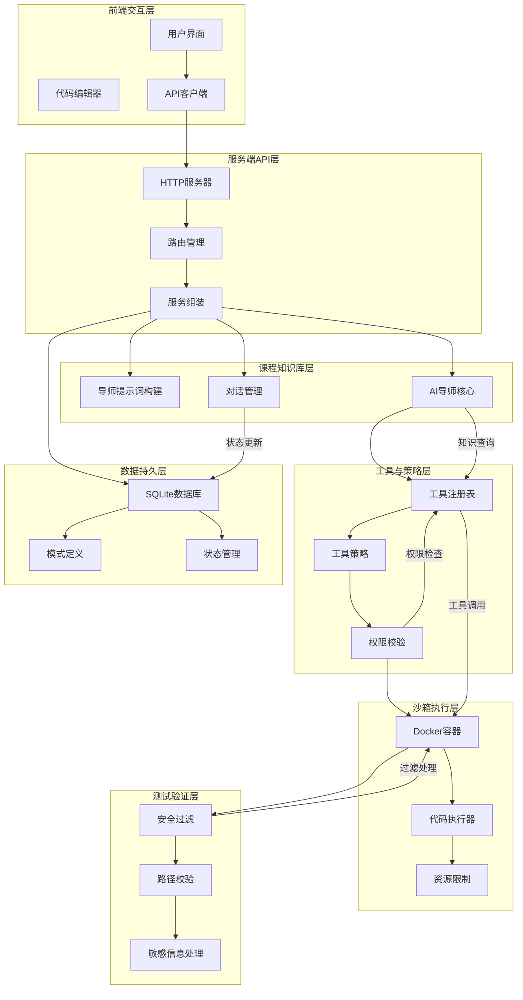
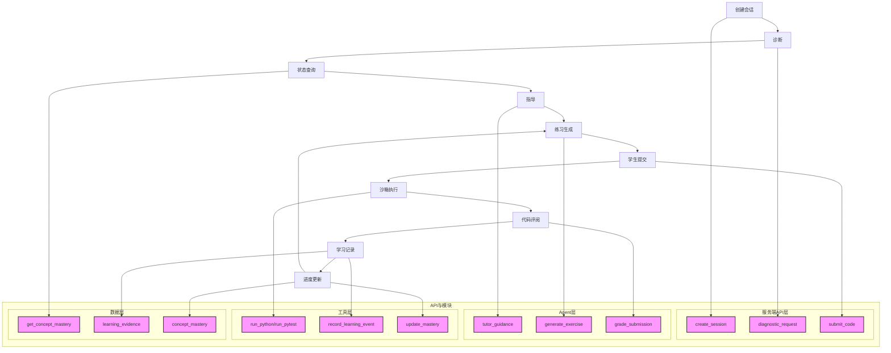

# 编程导师Agent系统架构分析报告

## A) 项目结构表（目录/关键文件/对应架构层/功能简述）

| 目录 | 关键文件 | 对应架构层 | 功能简述 |
| --- | --- | --- | --- |
| src/frontend | App.tsx, CodeEditor.tsx, api.ts | 前端交互层 | 提供用户界面组件，包括代码编辑器、Markdown渲染器和与后端API的通信接口 |
| src/server | main.ts, app.ts, services.ts | 服务端API层 | 应用入口点，HTTP服务器设置，API路由和服务组装 |
| src/agent | prompt.ts, pi-ai-tutor.ts | 课程知识库层 | 构建导师提示词，实现AI导师的核心逻辑，管理学习对话流程 |
| src/tools | registry.ts, tool-policy.ts | 工具与策略层 | 工具注册表定义可用工具集合，工具策略实施权限校验和安全边界 |
| src/sandbox | docker-runner.ts | 沙箱执行层 | 实现Docker容器安全执行Python代码，限制资源使用，隔离执行环境 |
| src/db | schema.ts, database.ts | 数据持久层 | 定义数据库表结构，管理SQLite数据存储，持久化学习状态和会话数据 |
| src/security | redaction.ts, path.ts | 测试验证层 | 实现敏感信息过滤、路径安全校验，确保系统安全隔离 |

## B) 关键源码"职责一句话 + 对外接口"清单

### src/server/main.ts

- **职责一句话总结**: 构建客户端资源并启动HTTP服务器，管理应用生命周期和数据库连接。
- **对外暴露接口**: 无直接接口，负责应用启动和关闭流程。
- **数据流方向**: 构建资源 → 创建运行时 → 创建应用 → 启动监听 → 关闭处理

### src/agent/prompt.ts

- **职责一句话总结**: 构建导师系统提示词，处理工具结果数据，剥离敏感信息。
- **对外暴露接口**:
  - `buildCourseSystemPrompt(config)`: 生成导师系统提示词
  - `summarizeToolEnvelopeForModel(envelope)`: 摘要工具结果供模型使用
- **数据流方向**: 配置信息 → 提示词构建 → 工具结果处理 → 安全过滤 → 模型输入

### src/tools/registry.ts

- **职责一句话总结**: 定义不同批次的工具白名单，提供工具名称获取功能。
- **对外暴露接口**:
  - `BATCH_A_ALLOWLIST`, `BATCH_B_ALLOWLIST`, `BATCH_C_ALLOWLIST`, `FULL_MVP_ALLOWLIST`: 工具集合常量
  - `getEnabledToolNames(batch)`: 根据批次获取启用工具列表
- **数据流方向**: 批次配置 → 工具集合过滤 → 工具名称列表

### src/tools/tool-policy.ts

- **职责一句话总结**: 实施工具调用策略，定义工具能力、风险级别和调用权限。
- **对外暴露接口**:
  - `TOOL_GROUP_POLICIES`: 工具组策略定义
  - `ToolPolicyDecision`: 工具决策结果类型
  - `ToolDefinition`: 工具定义接口
- **数据流方向**: 工具调用请求 → 策略评估 → 权限决策 → 执行/拒绝

### src/sandbox/docker-runner.ts

- **职责一句话总结**: 在Docker容器中安全执行Python代码，限制资源使用并处理执行结果。
- **对外暴露接口**:
  - `DockerSandboxClient`: 沙箱客户端类
  - `buildDockerRunArgs()`: 构建Docker运行参数
  - `runPython()`, `runPytest()`, `lint()`: 执行代码的方法
- **数据流方向**: 代码请求 → 容器准备 → 代码执行 → 结果收集 → 安全清理

### src/db/schema.ts

- **职责一句话总结**: 定义数据库表结构，包括会话、消息、概念掌握度和学习证据等核心实体。
- **对外暴露接口**:
  - `MIGRATION_001`: 数据库迁移脚本
  - 表定义: `concepts`, `agent_sessions`, `session_turns`, `concept_mastery`等
- **数据流方向**: 模式定义 → 数据库创建 → 数据持久化 → 查询访问

## C) 1个课程概念的字段分析与知识流转路径

### "列表"概念分析

#### 概念字段结构

- **定义**: 列表是Python中的一种有序可变序列，用于存储多个元素
- **示例**:

  ```python
  fruits = ["apple", "banana", "cherry"]
  numbers = [1, 2, 3, 4, 5]
  mixed = [1, "hello", 3.14]
  ```
- **常见错误**:
  - 索引越界：访问不存在的索引位置
  - 类型混淆：尝试对非列表类型使用列表方法
  - 修改不可变元素：尝试修改元组中的元素
- **相关练习**:
  - 列表基本操作：创建、访问、修改
  - 列表方法应用：append(), insert(), remove(), sort()
  - 列表推导式使用
- **前置概念**: 变量、基本数据类型、索引

#### 知识进入导师上下文/练习流程的路径

1. **知识库加载**:
   - 通过`kb_read_concept`工具从知识库获取"列表"概念内容
   - 工具路径: `src/tools/kb-tools.ts` → `kb_read_concept`
2. **导师提示词构建**:
   - 在`src/agent/prompt.ts`中构建系统提示词时，包含列表概念作为教学知识
   - 提示词通过`buildCourseSystemPrompt`函数注入
3. **诊断与状态追踪**:
   - 学生练习列表相关代码时，通过`session_practice_outcomes`记录结果
   - 系统更新`concept_mastery`表中列表概念的掌握度
   - 路径: `src/server/diagnostics.ts` → `src/db/schema.ts`
4. **练习生成**:
   - 使用`select_exercise`工具生成与列表相关的练习
   - 工具路径: `src/tools/exercise-tools.ts` → `select_exercise`
5. **代码执行与评阅**:
   - 学生提交的列表代码在沙箱中执行(`run_python`或`run_pytest`)
   - 结果通过`grade_submission`工具评阅
   - 路径: `src/sandbox/docker-runner.ts` → `src/tools/code-tools.ts`
6. **学习更新**:
   - 根据练习结果更新`learning_evidence`表
   - 路径: `src/server/progress-evidence.ts` → `src/db/schema.ts`

## D) Mermaid 系统结构图



## E) Mermaid 学习闭环流程图



## 可溯源证据清单

1. 项目结构文件路径:
   - `coding-mentor-agent/src/frontend/`
   - `coding-mentor-agent/src/server/`
   - `coding-mentor-agent/src/agent/`
   - `coding-mentor-agent/src/tools/`
   - `coding-mentor-agent/src/sandbox/`
   - `coding-mentor-agent/src/db/`
   - `coding-mentor-agent/src/security/`
2. 关键源码文件:
   - `coding-mentor-agent/src/server/main.ts`
   - `coding-mentor-agent/src/agent/prompt.ts`
   - `coding-mentor-agent/src/tools/registry.ts`
   - `coding-mentor-agent/src/tools/tool-policy.ts`
   - `coding-mentor-agent/src/sandbox/docker-runner.ts`
   - `coding-mentor-agent/src/db/schema.ts`
3. 课程知识库路径:
   - `coding-mentor-agent/kb/python-course-kb-practical-python/wiki/` (假设存在"列表"概念文件)
4. 数据库表结构定义:
   - `concepts`: 存储课程概念
   - `agent_sessions`: 存储会话信息
   - `session_turns`: 存储会话轮次
   - `concept_mastery`: 存储概念掌握度
   - `learning_evidence`: 存储学习证据