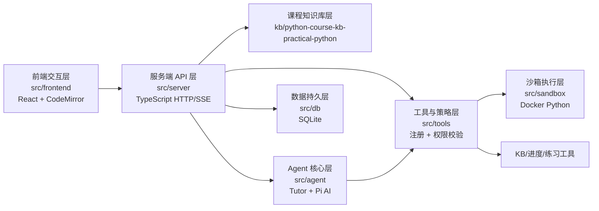
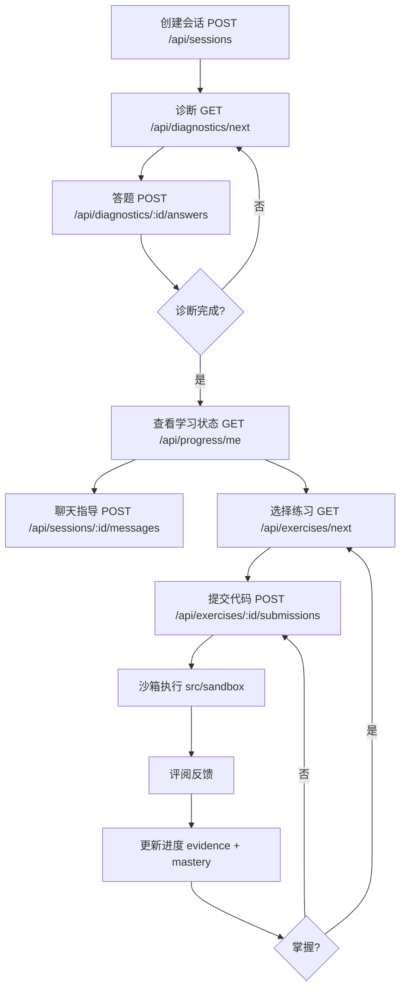

# 职位 1：架构分析师

## 你的身份
你是 5 人小组中的**架构分析师**，代号 **A**。你的核心职责是**阅读项目源码、梳理系统架构、绘制结构图与流程图、分析知识库**，为报告和 PPT 提供架构层面的素材。

## 项目背景
- 实验名称：Python 程序设计课程学伴 Agent
- 项目路径：`coding-mentor-agent/`
- 实验任务文档：`实验5.agent程序设计案例.txt`
- 实验步骤文档：`实验步骤.md`
- 项目仓库：https://github.com/xixu-me/coding-mentor-agent

## 你的工作范围
对应实验步骤文档的**步骤 3（项目结构与七层架构分析）**。你**不需要**启动系统、不需要 Docker、不需要 API Key，你的工作**纯静态分析**。

## 具体任务清单

### 任务 1：项目结构梳理
- 阅读 `coding-mentor-agent/README.md` 全文
- 浏览 `src/` 目录下 7 个子目录（frontend、server、agent、tools、sandbox、db、security）
- 列出每个子目录的关键文件（用 glob 工具）
- 输出到：`小组分工/A-产出/01-项目结构.md`
  - 格式：表格，列为"目录 / 关键文件 / 对应实验架构层 / 功能简述"

### 任务 2：七层架构源码阅读
按以下顺序阅读（不要求全读懂，重在梳理调用关系）：

| 优先级 | 文件路径 | 阅读目标 |
|---|---|---|
| 必读 | `src/server/main.ts` | 服务入口、路由注册 |
| 必读 | `src/agent/` 下提示词相关文件 | Tutor 系统提示词如何构造、如何注入 KB |
| 必读 | `src/tools/registry.ts` 和 `src/tools/policy.ts` | 工具注册与权限校验 |
| 必读 | `src/sandbox/runner.ts` | Docker 命令拼接、安全参数 |
| 必读 | `src/db/schema.sql` 或迁移脚本 | 数据库表结构 |
| 选读 | `src/server/` 下其他文件 | API 路由具体实现 |
| 选读 | `src/frontend/` | React 组件结构、CodeMirror 集成 |

阅读时记录每个文件的"职责一句话总结"和"对外暴露的接口/导出"。

### 任务 3：知识库深入分析（实验硬性要求）
- 浏览 `kb/python-course-kb-practical-python/wiki/` 结构
- 在 catalog 中找出一个**概念**（建议选"列表""字符串""函数"或"文件处理"之一）
- 完整阅读该概念对应的 `.md` 文件
- 记录以下信息到 `小组分工/A-产出/02-知识库概念分析.md`：
  - 概念名称
  - 文件路径
  - 包含的字段（定义、示例、常见错误、相关练习、前置概念等）
  - 该知识如何进入导师上下文（提示词注入路径）
  - 该知识如何进入练习流程（练习推荐路径）

### 任务 4：绘制系统结构图
- 工具：draw.io、ProcessOn、PPT、Markdown + mermaid 任选
- 要求包含：
  - 7 层架构（前端 / 服务端 / 知识库 / 工具与策略 / 沙箱 / 数据库 / 测试）
  - 标注每层对应的源码目录
  - 标注数据流方向（用箭头）
  - 标注关键模块名
- 输出：`小组分工/A-产出/03-系统结构图.png`（或 `.svg` / `.drawio`）

**Mermaid 模板**（可直接用）：

### 任务 5：绘制学习闭环流程图
- 输出：`小组分工/A-产出/04-学习闭环流程图.png`
- 包含节点：
  1. 创建会话
  2. 诊断（adaptive diagnostic）
  3. 学习状态/下一步建议
  4. 概念指导（聊天）
  5. 练习选择
  6. 代码提交
  7. 沙箱执行（Docker）
  8. 评阅（review）
  9. 进度更新（mastery + evidence）
  10. 回到第 5 步或第 4 步
- 每个节点标注：
  - 对应的 API 接口（如 `POST /api/sessions`）
  - 对应的源码模块

**Mermaid 模板**：

### 任务 6：架构分析文档
输出：`小组分工/A-产出/05-架构分析文档.md`

包含章节：
1. 七层架构概述（每层一句话）
2. 数据流向（前端 → 后端 → 各层）
3. 关键调用链（举 1–2 个例子，比如"用户提交代码"的完整调用链）
4. 知识库约束机制（回答任务 3 的"如何约束"部分）
5. 工具门禁机制（结合阅读源码说明）
6. 沙箱安全设计（结合阅读源码说明）
7. 学习证据的存储与流转

## 交付物清单
- [ ] `小组分工/A-产出/01-项目结构.md`
- [ ] `小组分工/A-产出/02-知识库概念分析.md`
- [ ] `小组分工/A-产出/03-系统结构图.png`（或同等格式）
- [ ] `小组分工/A-产出/04-学习闭环流程图.png`
- [ ] `小组分工/A-产出/05-架构分析文档.md`

## 你需要从他人处获取
- 无前置依赖。你是**第一个**开始工作的人
- B 的产出（截图、日志）不需要等，但你写完 05 文档后应该与 B 的沙箱测试结果交叉验证

## 你需要交付给
- **C（报告撰写员）**：05 文档 + 03 系统结构图 + 04 学习闭环流程图 + 02 概念分析
- **D（PPT 制作员）**：03 系统结构图 + 04 学习闭环流程图

## 时间安排
- 总时长：建议 3–5 天
- 第 1 天：完成任务 1、2（项目结构 + 源码阅读）
- 第 2 天：完成任务 3（知识库分析）
- 第 3–4 天：完成任务 4、5（两张图）
- 第 5 天：完成任务 6（架构分析文档）并自审

## 验收标准
1. 7 层架构的源码目录都能说清职责
2. 系统结构图包含全部 7 层和数据流
3. 学习闭环流程图覆盖完整闭环且标注 API/模块
4. 知识库概念分析至少包含 1 个概念的完整字段说明
5. 架构分析文档每个章节不少于 200 字

## 你可以使用的工具
- Read（读源码）
- Glob/Grep（搜索）
- Bash（列目录、看文件大小等只读操作）
- 不需要：Docker、npm install、npm start、AI API Key

## 沟通
- 每天向小组群同步进度
- 阻塞超过 2 小时立即在群里求助
- 产出完成后 @C 和 @D
